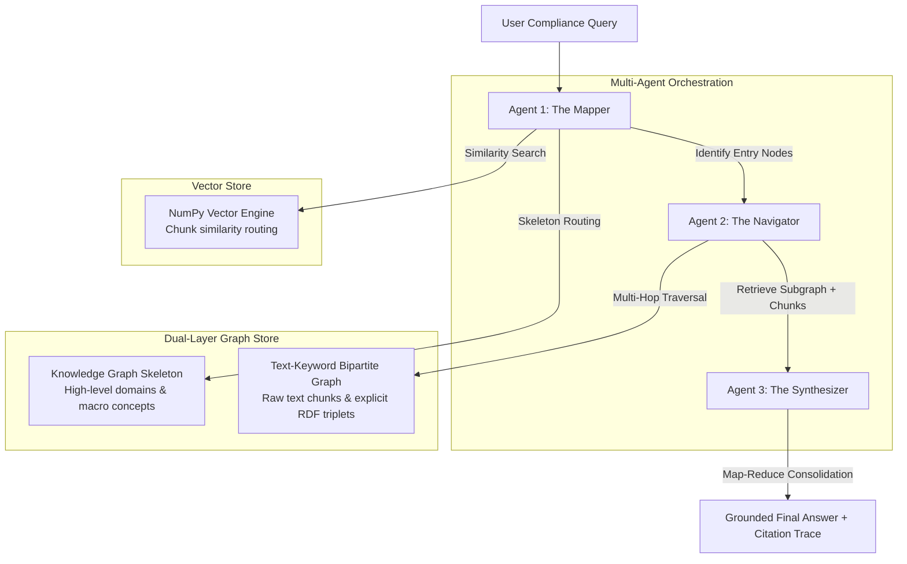

# System Architecture & Technical Explanation: Multi-Agent Graph-RAG

This document provides a deep technical breakdown of the **Multi-Agent Graph-RAG** implementation (`graph_rag_mini`). This architecture is designed to fulfill the requirements of high-quality corporate due diligence, regulatory compliance verification, and multi-hop logical reasoning over distributed text repositories.

---

## 1. The Core Limitation of Traditional RAG
Standard Retrieval-Augmented Generation (RAG) models rely on a simple workflow:
1. Divide documents into flat, sequential text chunks.
2. Generate vector embeddings for each chunk.
3. Query the database using vector cosine similarity to retrieve top-k chunks.
4. Pass the retrieved chunks to an LLM for generation.

### Why standard RAG fails:
*   **Multi-Hop Blind Spot**: If a query requires connecting a fact in *Doc A* (e.g., "Company X partners with Supplier B") with a fact in *Doc B* (e.g., "Supplier B stores data in Country F") and a rule in *Doc C* (e.g., "Act Z prohibits sharing data with Country F"), traditional RAG cannot connect the dots. It performs a parallel search, often retrieving irrelevant or fragmented chunks, leading to generation hallucinations or failure to identify compliance breaches.
*   **Loss of Contextual Hierarchy**: Flat chunking destroys parent-child relationships (e.g., specific clauses nested within federal sections).
*   **Data Heterogeneity**: Standard vector RAG struggles to parse key-value relationships in semi-structured JSON contract data or financial databases.

---

## 2. The Multi-Agent Graph-RAG Solution
To resolve these limitations, this project implements a **Multi-Granular (Dual-Layer) Graph Store** operated by a **collaborating multi-agent system**.

---

## 3. Detailed Component Breakdown

### 3.1. Dual-Layer Graph Architecture (`graph_store.py`)
Rather than constructing a monolithic, heavy graph that degrades query performance at scale, the database is split into two layers:
1.  **Knowledge Graph Skeleton (Top-Layer)**:
    *   Maps macro concepts, regulatory domains, and jurisdictions (e.g., `Compliance`, `Corporate Partnerships`, `Data Security`).
    *   Tracks how major domains relate, routing the initial search query to isolate the relevant subset of the database.
2.  **Text-Keyword Bipartite Graph (Lower-Layer)**:
    *   Combines **Chunk Nodes** (containing raw text and metadata) and **Entity Nodes** (representing named actors, systems, regulations, or concepts).
    *   Contains undirected edges between chunks and entities indicating a mention (`mentioned_in`).
    *   Contains explicit directed semantic relations (**RDF Triplets**: Subject $\rightarrow$ Predicate $\rightarrow$ Object) linking entities together (e.g., `Company X` --[`partners with`]--> `Supplier B`).

### 3.2. Dynamic RDF Triplet Extraction (`extractor.py`)
During document ingestion, text is chunked using a sliding window. For each chunk:
*   The system sends the text to the LLM with instructions to identify entities and extract RDF triplets.
*   The extractor maps the entities back to the chunks they came from, creating the bipartite layout.
*   It bridges the two layers by linking extracted entities directly to the Skeleton domains.

### 3.3. Multi-Agent Navigation Workflow (`agents/`)
Instead of performing a flat linear scan, three specialized AI agents cooperate:
1.  **The Mapper (Query Router)**:
    *   Receives the natural language query.
    *   Queries the NumPy vector database to fetch top-k similar chunks.
    *   Examines which entities appear in those chunks and uses the LLM to classify which Skeleton Domains apply.
    *   Pinpoints the starting "entry nodes" for traversal.
2.  **The Navigator (Graph-Aware Traverser)**:
    *   Begins at the Mapper's entry nodes.
    *   Performs multi-hop traversal (BFS pathfinding) up to a configurable depth limit.
    *   Collects all traversed RDF triplets and adjacent document chunks, forming a contextual subgraph.
3.  **The Synthesizer (Map-Reduce Answer Compiler)**:
    *   **Map Step**: Summarizes each retrieved document chunk individually to extract only facts relevant to the query.
    *   **Reduce Step**: Combines the chunk summaries and the traversed RDF triplets. Generates a comprehensive final compliance report.
    *   Formats a visible, step-by-step **Citation Path** detailing the exact logical chain navigated by the system.

---

## 4. Advanced Performance Optimizations

### 4.1. Latency Optimization via Relation-Free Flattening (Section 4.1)
Traversing dense local subgraphs (hubs with high degrees) traditionally increases path-finding latency exponentially. To maintain real-time performance:
*   We implement a `RELATION_FREE_THRESHOLD` check.
*   If a node has a degree exceeding the threshold (e.g., a central entity like "Customer Data" linked to hundreds of records), the Navigator temporarily flattens that local cluster.
*   It retrieves the neighboring entities directly as a list, bypassing expensive predicate-relation computations, reducing edge-traversal overhead during the retrieval phase.

### 4.2. Hybrid Relationship Categorization (Section 4.2)
To handle both standard statutory rules and bespoke contractual clauses, we use a dual-branch algorithm:
1.  **Supervised Branch**:
    *   Matches predicates against a set of predefined corporate/regulatory relationships (e.g., `must comply with`, `violates`, `prohibits sharing with`).
2.  **Unsupervised Clustering Fallback**:
    *   For custom contract clauses, the system computes the embedding of the unknown predicate.
    *   It measures the cosine distance against standard predicate embeddings using NumPy.
    *   If similarity is above $0.75$, it clusters the relationship to the closest standard category. Otherwise, it creates a new organic relationship group.

---

## 5. Architectural Comparison

| Feature | Traditional Vanilla RAG | Monolithic Graph-RAG | Proposed Multi-Agent Graph-RAG |
| :--- | :--- | :--- | :--- |
| **Knowledge Representation** | Flat text chunks | Single massive entity graph | **Multi-Granular (Skeleton + Bipartite)** |
| **Reasoning Depth** | Single-hop | Multi-hop | **Advanced Multi-hop (Dynamic Agentic)** |
| **Latency at Scale** | Minimal | High (exponential edge checking) | **Optimized (Relation-free flattening)** |
| **Hallucination Rate** | High (disconnected contexts) | Medium | **Extremely Low (Paths audited & grounded)** |
| **Auditability** | Poor (shows random paragraphs) | Moderate | **High (Traversal path printed as proof)** |

---

## 6. Business Value and Benefits
*   **Factual Auditability**: In regulated industries like finance, healthcare, or legal AI, black-box answers are unacceptable. Mini-Graph-RAG allows auditing attorneys to visually verify the reasoning chain before acting on compliance suggestions.
*   **Cross-System Connection**: Perfect for post-merger integration, checking if Subsidiary A's IT practices violate Parent Company B's data security guidelines, or identifying dependencies across hundreds of vendor contracts.
*   **Infrastructure Efficiency**: By splitting indices into a dual-layer Skeleton and Bipartite model, query spaces are routed and filtered early, permitting execution in resource-constrained environments.
